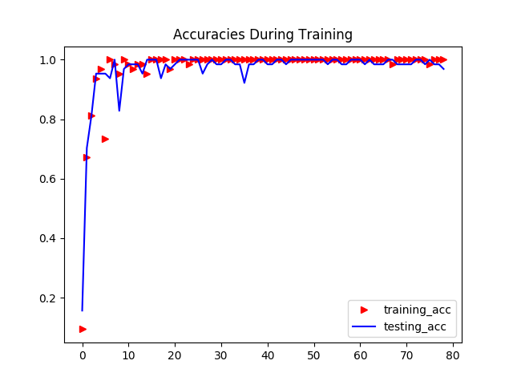
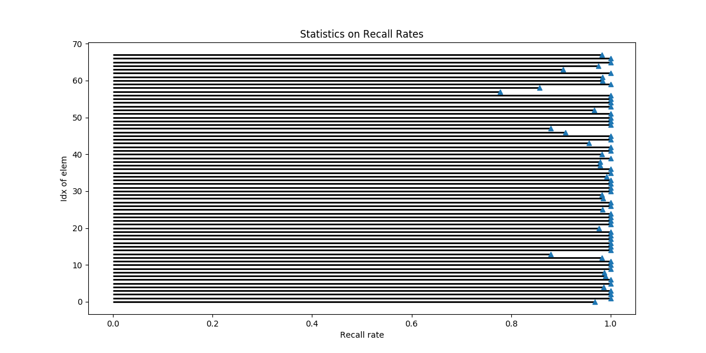
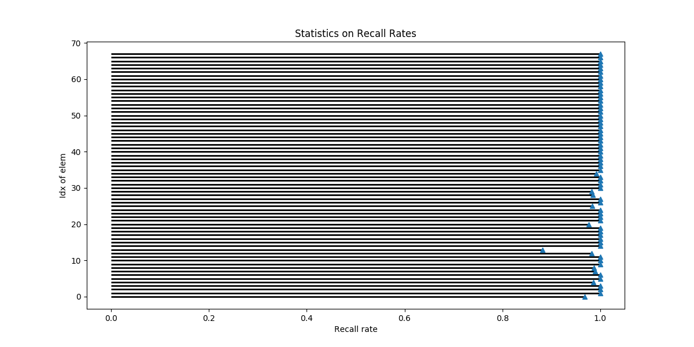
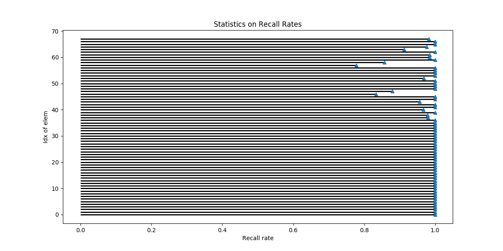
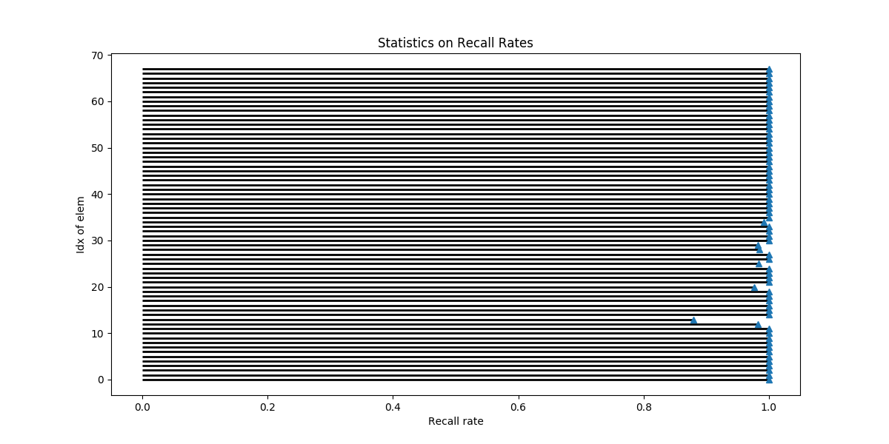
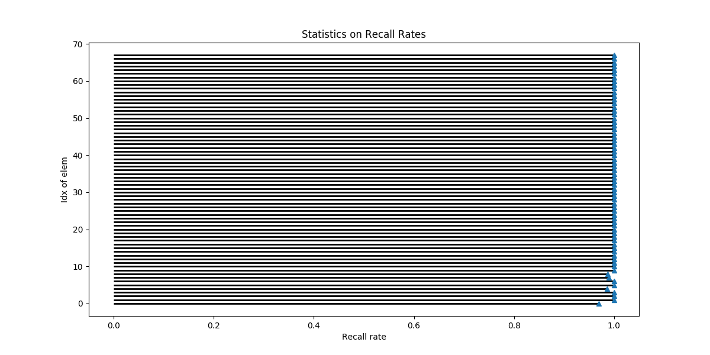

# 17b-ZhengPeng-2015
> Owner: 2015-2-Peng Zheng, to store Machine Learning onclass work.

1. Fashion_Challenge
    - Data preprocessing:
        + [MNIST -> tfrecords](https://github.com/m-L-0/17b-ZhengPeng-2015/tree/master/FashionMNIST_Challenge/format_transformation)
        + [tfrecords -> images](https://github.com/m-L-0/17b-ZhengPeng-2015/tree/master/FashionMNIST_Challenge/format_transformation)

    - Neural networks:
        + [KNN on Fashion_MNIST with accuracy 86.5%](https://github.com/m-L-0/17b-ZhengPeng-2015/tree/master/FashionMNIST_Challenge/KNN_method)
        + [K-means Algorithm](https://github.com/m-L-0/17b-ZhengPeng-2015/tree/master/FashionMNIST_Challenge/K-means_method)
        + [A three layer feedforward neural network with 90.37%](https://github.com/m-L-0/17b-ZhengPeng-2015/tree/master/FashionMNIST_Challenge/fashion_mnist)
        + [A VGG-like neural network with 92.32% accuracy](https://github.com/m-L-0/17b-ZhengPeng-2015/tree/master/FashionMNIST_Challenge/vgg_like_in_keras)
        + [A simple CNN ](https://github.com/m-L-0/17b-ZhengPeng-2015/blob/master/FashionMNIST_Challenge/common_cnn_method.ipynb)
        + [Capsule neural network with 89% accuracy](https://github.com/m-L-0/17b-ZhengPeng-2015/tree/master/FashionMNIST_Challenge/CapsNet-Fashion-MNIST)

2. Vehicle_Lincense_Plate_Recognition
    - Data Transformation:
        + img <--> tfrecords -> array
    - Construct Lenet-5
    - Restore Lenet-5
        > In saved model:

        | matches | Validation Accuracy |
        | :-----: | :------: |
        | 字母+数字+汉字 | 98.98% |
        | 字母+数字 | 99.35% |
        | 汉字 | 97.48% |
        | 字母 | 99.40% |
        | 数字 | 99.27% |
        &emsp;&emsp;**Accuracies on training set and test set**
        
        &emsp;&emsp;**Recall Rates on Alphabet, integers and Chinese_letters**
        
        &emsp;&emsp;**Recall Rates on Alphabets and Integers**
        
        &emsp;&emsp;**Recall Rates on Chinese_letters**
        
        &emsp;&emsp;**Recall Rates on Alphabet**
        
        &emsp;&emsp;**Recall Rates on Integers**
        

